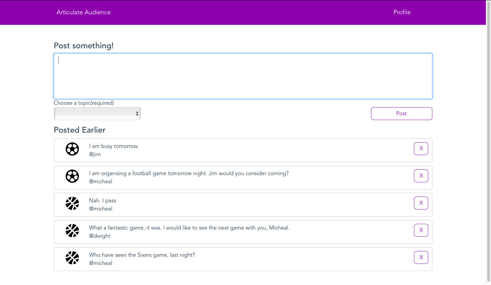
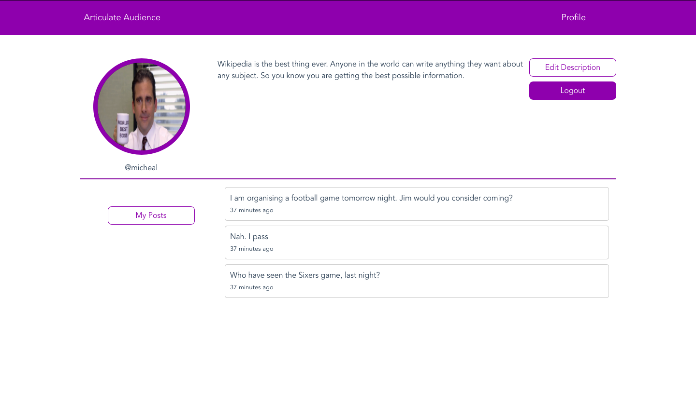

# Articulate Audience

Articulate Audience is a social network project that is focused on connecting sports admirers. With this project, I endeavor to improve my hands-on Javascript skills. Have been working on this project for only 1 month, I add new features regularly.

### Tech

Articulate Audience uses a number of open source projects to work properly:

* [node.js] - evented I/O for the backend
* [Vue.js] -  a progressive framework for building user interfaces
* [Express] - fast node.js network app framework
* [MongoDB] - a general purpose, document-based, distributed database
* [Twitter Bootstrap] - great UI boilerplate for modern web apps
* [Font Awesome] - easy-to-use icon resource for UI


### Installation

```sh
$ cd bicycle
$ cd app
$ npm install
```
```sh
$ cd bicycle
$ cd api
$ npm install
```

### Running the Project

First Tab(for the api):
```sh
$ cd api
$ npm start
```

Second Tab(for the app):
```sh
$ cd app
$ npm run dev
```

### Todos

 - Add User Search Engine
 - Add Night Mode
 - Add Resizer Controller
 - Test Module
 - Password Reset
 
 

   [Vue.js]: <https://vuejs.org>
   [Twitter Bootstrap]: <https://getbootstrap.com>
   [Font Awesome]: <https://fontawesome.com>
   [node.js]: <http://nodejs.org>
   [express]: <http://expressjs.com>
   [MongoDB]: <https://www.mongodb.com>
